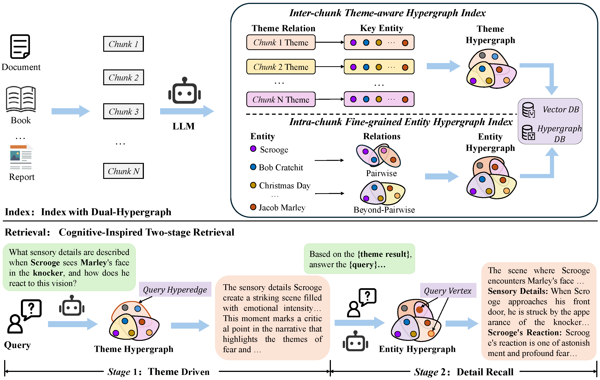
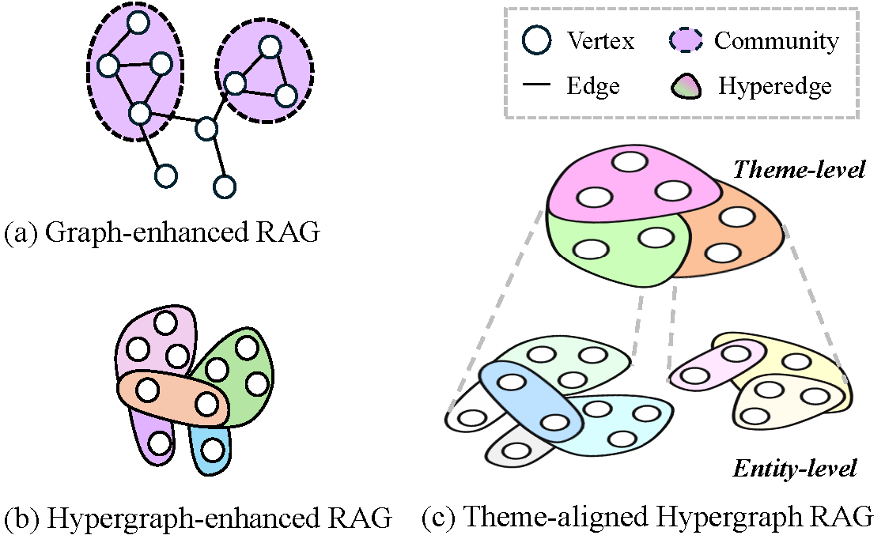

<div align="center">

# 🧠 Cog-RAG

**[AAAI2026] Cog-RAG: Cognitive-Inspired Dual-Hypergraph with Theme Alignment Retrieval-Augmented Generation**

[](https://www.python.org/downloads/) [](https://opensource.org/licenses/MIT) [](https://aaai.org/conference/aaai/aaai-26/)

> 📝 **Accepted by AAAI 2026**

</div>

---

## Overview

**Cog-RAG** is a cognitive-inspired retrieval-augmented generation framework that utilizes dual-hypergraph structures with theme alignment for enhanced knowledge retrieval and question answering.

### ✨ Key Features

| Feature | Description |
|---------|-------------|
| 🔗 **Dual-Hypergraph Architecture** | Separates entity-level and theme-level knowledge representation for richer context modeling |
| 🎯 **High-Order Relationship Model** | Captures multi-entity relationships beyond traditional binary edges |
| 🧠 **Two-Stage Retrieval** | Theme awareness → Entity alignment for cognitive-inspired retrieval |
| 🔄 **Multiple Query Modes** | Flexible strategies optimized for different retrieval scenarios |
| 📦 **Easy Integration** | Simple API compatible with OpenAI, local LLMs, and custom models |

---

## 🏗️ Architecture

<div align="center">



*Figure 1: Cog-RAG*

</div>

<div align="center">



*Figure 2: Traditional Graph RAG vs. Cog-RAG*

</div>

---

## 📦 Installation

### Requirements

- Python >= 3.10

### Setup

```bash
# Clone the repository
git clone https://github.com/haoohu/Cog-RAG.git
cd Cog-RAG

# Create virtual environment with conda
conda create -n cograg python=3.10
conda activate cograg

# Install dependencies
pip install -r requirements.txt
```

---

## 🚀 Quick Start

### 1️⃣ Configure API Credentials

Create your configuration file:

```bash
cp config_temp.py my_config.py
```

Edit `my_config.py` with your API credentials:

```python
# LLM Configuration
LLM_BASE_URL = "https://api.openai.com/v1"  # Or your custom endpoint
LLM_API_KEY = "your-api-key"
LLM_MODEL = "gpt-4o-mini"

# Embedding Configuration  
EMB_BASE_URL = "https://api.openai.com/v1"
EMB_API_KEY = "your-api-key"
EMB_MODEL = "text-embedding-3-small"
EMB_DIM = 1536
```

### 2️⃣ Initialize and Use Cog-RAG

```python
import asyncio
from cograg import CogRAG, QueryParam
from cograg.utils import EmbeddingFunc

# Initialize Cog-RAG
rag = CogRAG(
    working_dir="./my_rag_cache",
    llm_model_func=your_llm_func,           # Your LLM function
    embedding_func=EmbeddingFunc(
        embedding_dim=1536,
        max_token_size=8192,
        func=your_embedding_func            # Your embedding function
    ),
)

# Insert your documents
rag.insert("""
Your document content here.
You can insert multiple documents.
""")

# Query with Cog-RAG retrieval mode
response = rag.query(
    query="What are the main themes?",
    param=QueryParam(mode="cog")  # Two-stage theme-entity retrieval
)

print(response)
```

---

## Examples

The `examples/` directory contains:

- **cograg_demo.py** - Complete demo showing end-to-end workflow
- **mock_data.txt** - Sample data for testing and learning

Run the demo:

```bash
python ./examples/cograg_demo.py
```

---

## 📚 Citation

If you use Cog-RAG in your research, please cite:

```bibtex
@article{cograg2025,
  title={Cog-RAG: Cognitive-Inspired Dual-Hypergraph with Theme Alignment Retrieval-Augmented Generation},
  author={Hu, Hao and Feng, Yifan and Li, Ruoxue and Xue, Rundong and Hou, Xingliang and Tian, Zhiqiang and Gao, Yue and Du, Shaoyi},
  journal={arXiv preprint arXiv:2511.13201},
  year={2025}
}
```

📖 Paper: https://arxiv.org/abs/2511.13201

we also welcome citations to our work Hyper-RAG, which pioneered pure hypergraph-enhanced RAG approaches.


```bibtex
@article{hyperrag2025,
  title={Hyper-RAG: Combating LLM Hallucinations using Hypergraph-Driven Retrieval-Augmented Generation},
  author={Feng, Yifan and Hu, Hao and Hou, Xingliang and Liu, Shiquan and Ying, Shihui and Du, Shaoyi and Hu, Han and Gao, Yue},
  journal={arXiv preprint arXiv:2504.08758},
  year={2025}
}
```

📖 Hyper-RAG Paper: https://arxiv.org/abs/2504.08758

---

## 🙏 Acknowledgements

We thank the following projects for their contributions:

- **[LightRAG](https://github.com/HKUDS/LightRAG)** - Graph-enhanced RAG framework
- **[Hyper-RAG](https://github.com/iMoonLab/Hyper-RAG)** - Hypergraph-enhanced RAG framework
- **[Hypergraph-DB](https://github.com/iMoonLab/Hypergraph-DB)** - Hypergraph storage and management


## 📄 License

This project is licensed under the **MIT License** - see [LICENSE](LICENSE) for details.

## 🤝 Contributing

Contributions are welcome! Please feel free to open issues or submit pull requests.

---

<div align="center">

**⭐ If you find Cog-RAG useful, please consider starring us on GitHub! ⭐**

</div>
